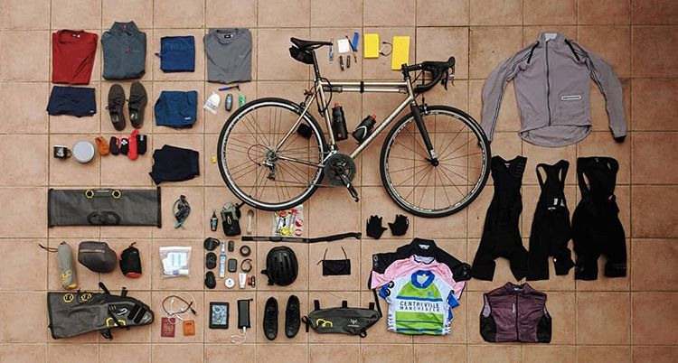

My kit list for cycling around Spain for 2 months from September to November is as follows:

**Kit**:
1x Cycling mits to keep the pressure points off
1x Vermarc basic cycling jersey
1x Rapha Pantani Anniversary Jersey
1x ABC Centreville Cycling Club Jersey
5x Cycling socks
1x Santini Windproof Gilet
1x Rapha Windproof Jacket
1x Rapha Brevet Cargo Shorts
1x Rapha Pro Team Shorts
1x Castelli Shorts

**Cycling accessories**:
1x Fabric Multi-Tool
1x Quick Link
4x Inner Tube
1x Frame Pump
1x Puncture Repair Kit
3x ParkTool Tyre Levers
1x ParkTool tyre bung
1x ParkTool quick repair patches
1x Roka Sunglasses (Thanks Aaron!)
1x Sweet Protection Outrider Helmet
1x Garmin 530
1x Quoc Night Road Shoes (SPD-SL)
1x Garmin Heart Rate Monitor
1x Exposure Tracr lightset
1x Hiplok Combination Z-Lock
1x Cermanic Clean Lube - Decanted into a mukoff bottle.

**Casual Clothing**:
2x Rapha Technical tshirt - Grey and Maroon
1x Patagonia base layer - Blue
1x Patagonia Baggies swimshorts - Blue
1x Rapha Randonnee Shorts - Black
1x All Birds trainers
1x Rab Nucleas Fleece

**Sleeping Kit**:
1x Mountain Warehouse Helium sleeping bag
1x Alpkit Cloudbase
1x Alpkit Hunka Bivvy bag

**Technology**:
1x Google Pixel 2
1x Google Pixel Earphones
1x GoPro Hero 6
1x HTC European Charger
1x Micro multiple charger (USB-C, MicroUSB, Thunderbolt)
2x MicroUSB 
1x USB-C
1x HeadTorch
1x Anker Powerbank
1x Mini Bluetooth Speaker

**Toiletries**:
1x Deodorant
1x Dove Beauty Soap (Smooth and lathery)
1x P20 Sunscreen
1x Toothbrush
1x Toothpaste
1x Sudocreme
1x Nivea Creme
1x Trespass Travel Towel

**Cooking**:
1x Trangia Mini
1x GSI Ultralight Java Drip

**Other**:
2x Paper Pads
1x Bobbin Pen
1x Swiss Army Knife
1x Leatherman Mini - Kept with tools
1x Bungee Cord
1x Barn Berlin Enamel Cup
5x Cable Ties
1x Insulation tape

**Sent Home**:
1x Gilet
1x Rapha Pantani Jersey
1x Mini Speaker
1x Trangia Mini
1x GSI Ultralight Java Drip

**The Good**:
Good pairs of bib shorts are absolutely essential for this kind of trip, as you are going to be spending a lot of time in them. I absolutely love the Cargo shorts from Rapha, they have been amazing to wear with a technical t-shirt. I will be buying more of these as they are super versitle shorts. You have pockets in the back as well as on the side of the leg. The rapha Windproof Jacket kept me warm enough even on the descents in Andorra. So far I have seen no rain!

Insulation tape has been immensely useful for patching up my handlebars where they have torn and taping innertubes or rub points on my frame up. 

**The Bad**:
I did absolutely no cooking and was finding it hard to justify carrying a stove and coffee making equipment around. I did end up making overnight oats in a bath tub and at numerous camping points, but it was not worth it. I had the cup that I could make overnight oats in too. This went home. After the pyrenees it was unlikely I would need a Gillet and a Jacket, so the Gillet went home. The minispeaker was a mistake as it was not used whatseover for the first 2 years, earphones are more suitbale! I sent the third Pantani jersey home as I thought it made me look like a bit of a fool and it also has resale value. 
